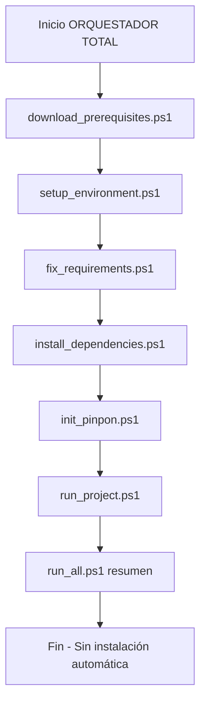

# ORQUESTADOR TOTAL PINPON

Este documento describe el **orquestador total** del repositorio en modo seguro:

- No instala automáticamente.
- No descarga automáticamente.
- No ejecuta automáticamente la app.
- Sí detecta estado y genera comandos exactos para ejecutar manualmente.

---

## 1) Scripts del orquestador

### scripts/download_prerequisites.ps1

Rol:

- Detecta Python, Node, Git y Poppler.
- Muestra enlaces oficiales y comandos `winget`.
- Modo dry-run: no ejecuta instalaciones.

### scripts/setup_environment.ps1

Rol:

- Valida Python, pip y `.venv`.
- Si falta `.venv`, muestra el comando para crearla.
- Valida estructura mínima del proyecto.

### scripts/fix_requirements.ps1

Rol:

- Valida `requirements.txt`.
- Detecta conflictos Git (`<<<<<<<`, `=======`, `>>>>>>>`).
- Detecta duplicados y líneas inválidas.
- Genera `requirements.generated.txt` limpio.
- Valida pines `==` contra PyPI.

### scripts/install_dependencies.ps1

Rol:

- Genera comandos `pip` para instalación.
- Incluye validación de `pip`, `setuptools`, `wheel` mediante comandos sugeridos.
- No instala nada automáticamente.

### scripts/init_pinpon.ps1

Rol:

- Valida `node/npm`.
- Si faltan, muestra enlace y comando oficial.
- Verifica `agent.yaml`, `agent.local.settings.json`, `knowledge/`, `actions/`.
- Muestra plantillas sugeridas si faltan.

### scripts/run_project.ps1

Rol:

- Valida `.venv` y `app.py`.
- Genera el comando final para Streamlit.
- No ejecuta la aplicación.

### scripts/run_all.ps1

Rol:

- Orquesta el flujo completo en modo seguro:

1. Prerequisitos
2. Entorno
3. Requirements
4. Comandos de instalación
5. Init PINPON
6. Comando final de ejecución

---

## 2) Menú Streamlit (panel de control)

Archivo: `app_menu.py`

Características:

- Sidebar con botones del orquestador.
- Cada botón ejecuta su script correspondiente vía `subprocess.run`.
- Cada botón tiene tooltip explicando su rol completo.
- La salida del script se muestra en pantalla con `st.code(...)`.

Botones:

- Prerequisitos
- Setup
- FixReq
- Instalar
- PINPON
- Run
- RunAll

---

## 3) Cómo ejecutar la app del menú

Comando sugerido:

`python -m streamlit run app_menu.py`

> Si usas venv: `./.venv/Scripts/python.exe -m streamlit run app_menu.py`

---

## 4) Cómo usar los botones

1. Inicia por **Prerequisitos**.
2. Sigue con **Setup**.
3. Ejecuta **FixReq** para revisar dependencias.
4. Revisa **Instalar** para obtener comandos pip.
5. Ejecuta **PINPON** para validar estructura del agente.
6. Usa **Run** para obtener comando final de Streamlit.
7. Usa **RunAll** para recorrer todo el flujo en una sola corrida segura.

---

## 5) Tooltips (qué hace cada uno)

- Prerequisitos: valida Python/Node/Git/Poppler y muestra comandos oficiales.
- Setup: valida Python/pip/venv y estructura base del repo.
- FixReq: valida requirements, limpia duplicados y detecta conflictos.
- Instalar: imprime comandos pip (`pip`, `setuptools`, `wheel`, `-r requirements`).
- PINPON: valida node/npm y estructura declarativa del agente.
- Run: valida entrada y emite comando Streamlit final.
- RunAll: recorre todo el pipeline de validación y comandos sugeridos.

---

## 6) Flujo recomendado

1. `scripts/download_prerequisites.ps1`
2. `scripts/setup_environment.ps1`
3. `scripts/fix_requirements.ps1`
4. `scripts/install_dependencies.ps1`
5. `scripts/init_pinpon.ps1`
6. `scripts/run_project.ps1`
7. `scripts/run_all.ps1` (opcional para recorrer todo)

---

## 7) Diagrama de flujo del orquestador

